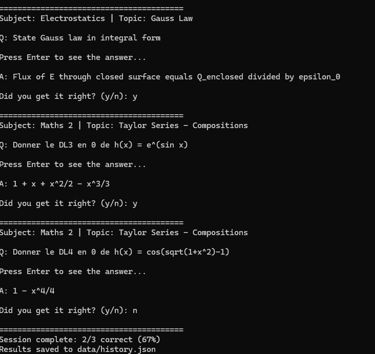
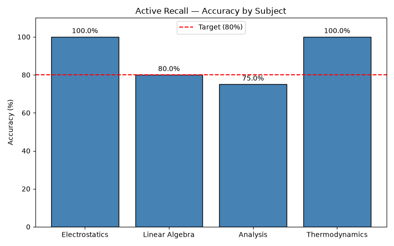

# 🧠 active-recall-cli

A command-line tool for spaced repetition study sessions.
Load questions from CSV, run interactive sessions, track your history,
and visualize your progress over time.


---

## ✨ Features

- 📂 Load questions from a simple CSV file
- 🎯 Interactive study sessions with self-assessment
- 🧠 Smart mode — prioritizes questions you fail most
- 📊 Per-subject accuracy statistics in terminal
- 📈 Progress bar chart exported as PNG
- 🔍 Filter by subject, difficulty, and session size
- 💾 Persistent session history in JSON

---
## 📸 Demo

**Study session:**



**Progress chart:**



## ⚙️ Installation

**1. Clone the repository**
```bash
git clone https://github.com/david-deluca/active-recall-cli.git
cd active-recall-cli
```

**2. Install dependencies**
```bash
pip install -r requirements.txt
```

---

## 🚀 Usage

**Run a standard session (5 random questions):**
```bash
python main.py
```

**Run a smart session (prioritizes weak areas):**
```bash
python main.py --smart
```

**Filter by subject:**
```bash
python main.py --subject Thermodynamics
```

**Filter by minimum difficulty:**
```bash
python main.py --difficulty 3
```

**Set number of questions:**
```bash
python main.py --n 10
```

**View accuracy statistics:**
```bash
python main.py --stats
```

**Generate progress chart:**
```bash
python main.py --plot
```

---

## 📋 CSV Format

Questions are stored in `data/sample.csv` with the following structure:

| Column | Description | Example |
|--------|-------------|---------|
| id | Unique question ID | THM_001 |
| subject | Subject name | Thermodynamics |
| topic | Specific topic | First Law |
| question | The question text | What does delta_U represent? |
| answer | The answer text | Change in internal energy |
| difficulty | Difficulty level (1-3) | 2 |

---

## 📁 Project Structure
active-recall-cli/

├── main.py              # Entry point — CLI interface

├── src/

│   ├── loader.py        # CSV reader

│   ├── storage.py       # JSON persistence

│   ├── stats.py         # Statistics engine

│   ├── plotter.py       # Matplotlib chart generator

│   └── smart.py         # Spaced repetition logic

├── data/

│   ├── sample.csv       # Question bank

│   └── history.json     # Session history (auto-generated)

├── output/

│   └── progress.png     # Generated chart (auto-generated)

├── requirements.txt

└── README.md
---

## 🗺️ Roadmap

- [x] Load questions from CSV
- [x] Interactive session loop
- [x] JSON persistence
- [x] Subject and difficulty filters
- [x] Per-subject statistics
- [x] Progress chart
- [x] Smart mode (spaced repetition)
- [ ] Unit tests with pytest
- [ ] Export session report to PDF
- [ ] Web interface with Flask

---

## 📄 License

MIT License — see [LICENSE](LICENSE) for details.